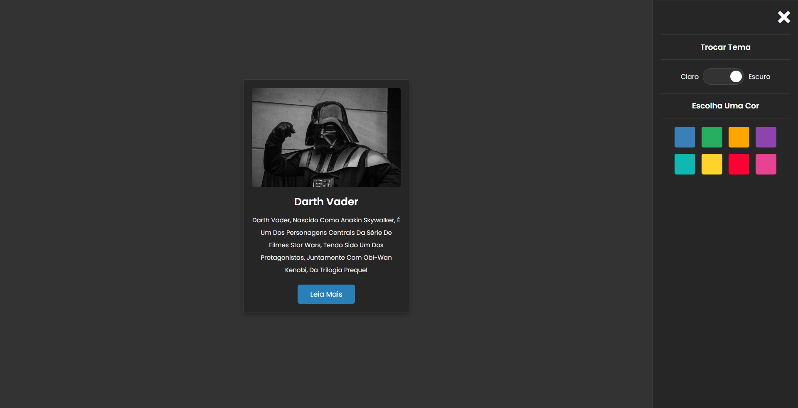

<h1 align="center">
    Escolha o tema
</h1>

<h1 align="center">
    
</h1>

<h3 align="center">Você pode acessar o projeto <a href="https://change-theme-one.vercel.app/" target="_blank">clicando aqui</a></h3>

---

</br>

# Sobre o projeto

**Escolha o tema** é um projeto é um projeto que fiz durante meu aprendizado de CSS e JS.
</br>
</br>
<br/>

# Tecnologias

- [Html](https://www.w3schools.com/html/)
- [Css](https://www.w3schools.com/css/)
- [JavaScript](https://developer.mozilla.org/en-US/docs/Web/JavaScript)

---

<br/>

## Como baixar o projeto:

```bash
# Clonar o repositório
$ git clone https://github.com/mateusarcedev/change-theme
# Entrar no diretório
$ cd devtips
```

---

<p align="center"> Desenvolvido por <a href="https://www.linkedin.com/in/mateus-arce/">Mateus Arce</a> ✌🏼</p>